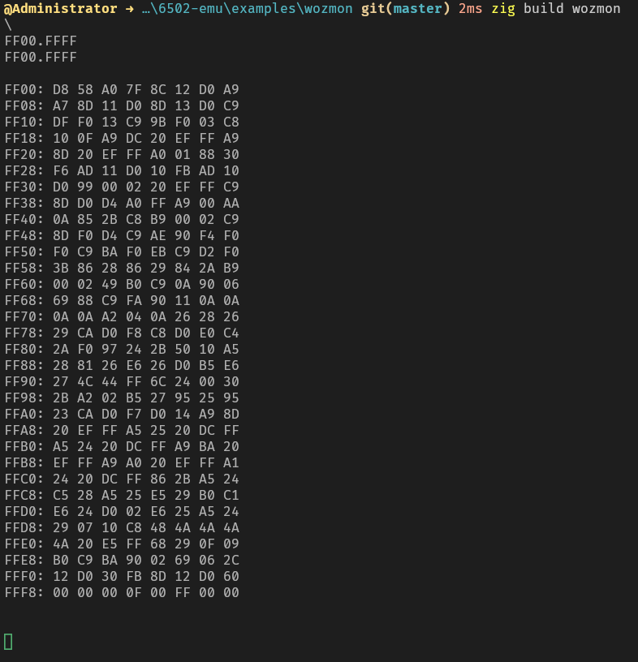

# 6502-emu
Simple 6502 emulator written in Zig (0.16).

The emulator is written as a library (inspired by [fake6502](https://github.com/omarandlorraine/fake6502) by Mike Chambers), so you need to implement a memory bus yourself with `write` and `read` functions exposed (see `examples/main.zig`). This lets the user implement their own memory mapping.

Passes 6502 functional tests by [Klaus Dormann](https://github.com/Klaus2m5/6502_65C02_functional_tests) (including decimal mode).

Used AI to generate the unit tests, all other code is hand-written.

## Rom builder
I've included a simple utility in `src/rom_builder.zig` to build test machine code programs. Usage is shown in `examples/main.zig`. 

## Build
Do `zig build` to build the library and examples (for some examples you will need [cc65](https://github.com/cc65/cc65/) assembler and linker).

 Outputs executables (tests and example) and a static library.

## Tests
* Do `zig build run` to build and run the example (`examples/main.zig`).

* Do `zig build ftest` to build and run Klaus Dormann's functional test.

* Do `zig build utest --summary all` to build and run unit tests.

## Examples
* Wozmon - `examples/wozmon`

* MSBASIC - WIP
